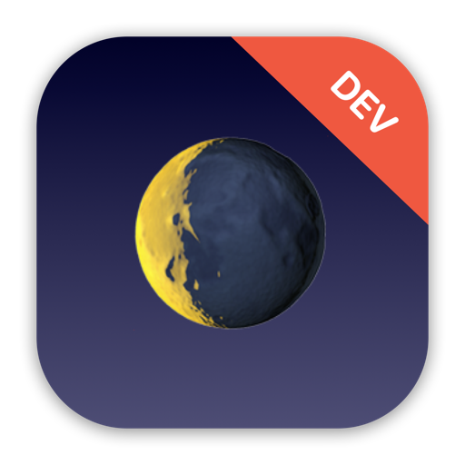

    

    
    
    

  ***Note**: The app icon above should only be used for development purposes only, not for submission to the App Store due to the license on SF Symbols and Emoji.*

 

Moonshot is an informational app that lets users learn about the missions and astronauts that formed NASA’s Apollo space program.

At its core, the app is built in SwiftUI and it features multiple screens that display information about the Apollo's missions and its individual crew members. There are a total of 12 Apollo missions, from Apollo 7 to 17 along with the very first Apollo mission - Apollo 1. 

As users tap on any of the listed Apollo missions, a new screen will display it's mission highlights along with the astronaut crew members on that mission. Tapping on any of the astronaut crew members will display another screen with a description of the individual, such as their full name, birth date, deceased date (if any), university attended, accomplishments, etc.

All information on the missions and astronauts data are parsed and decoded from their associated JSON files - `missions.json` & `astronauts.json`. The images of astronauts and mission badges were all created by NASA, and they are available to use under a public domain license. 

## App preview

## Trying it yourself

Moonshot is written using Xcode 13.2 and Swift 5.0. To try it out, you can clone this project and build it immediately by opening `Moonshot.xcodeproj`.

As far as I know the app feature is complete, but there are likely to be errors all over the place at least to begin with – if you hit any problems, either building or running the app, please let me know.

## Important notes on usage

Keep in mind that this app is simply a project designed and built for my own personal educational purposes only. The sole purpose for this app project was to gain practical experience in building an app in iOS with Swift & SwiftUI. The state of this app was never meant to be production-ready, published onto the App Store, or to be monetized in any way, shape, or form.

If you wish to do any of the above, you will have to make some changes to the app before submitting to the App Store for approval. Please keep in mind of any potential violation of third-party license, such as, but not limited to, the usage of SF Symbols and/or Emoji of the app icon.

## Credits

Swift, the Swift logo, Xcode, Instruments, SF Symbols, Emoji, Cocoa Touch, iPhone, iPad, Safari, App Store, watchOS, tvOS, Mac and macOS are trademarks of Apple Inc., registered in the U.S. and other countries.

## License 

This project is under the terms of the MIT license. For more information, please refer to the license [documentation](LICENSE).